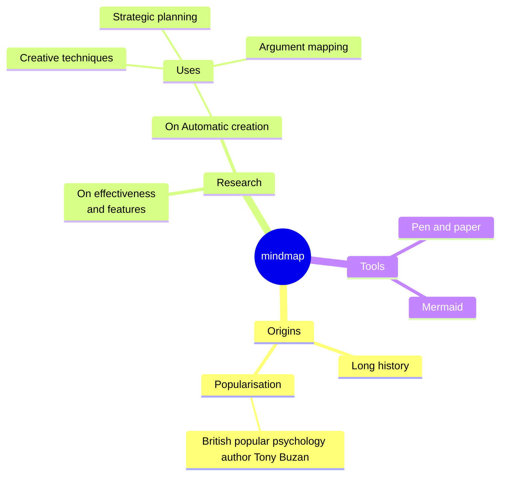
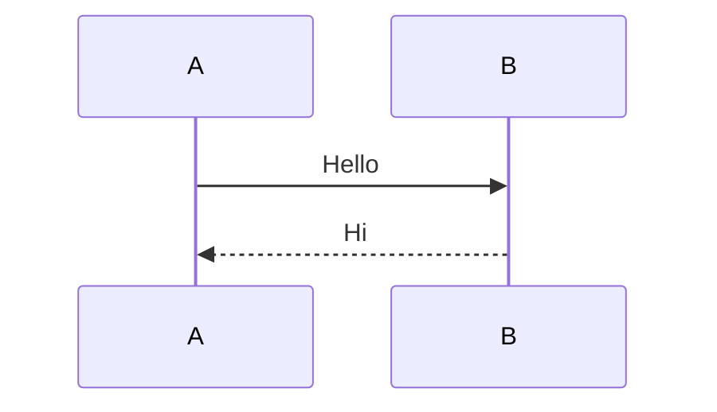
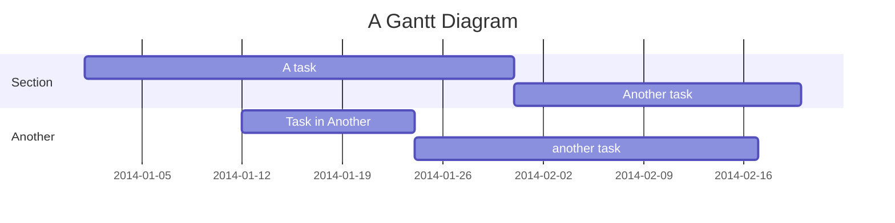

# Mermaid

::: info custom-info
We are using [vitepress-mermaid-preview](https://www.npmjs.com/package/vitepress-mermaid-preview) dependency
:::







::: code-group

```js [config.js]
/**
 * @type {import('vitepress').UserConfig}
 */
const config = {
  // ...
}

export default config
```

```ts [config.ts]
import type { UserConfig } from 'vitepress'

const config: UserConfig = {
  // ...
}

export default config
```

:::
